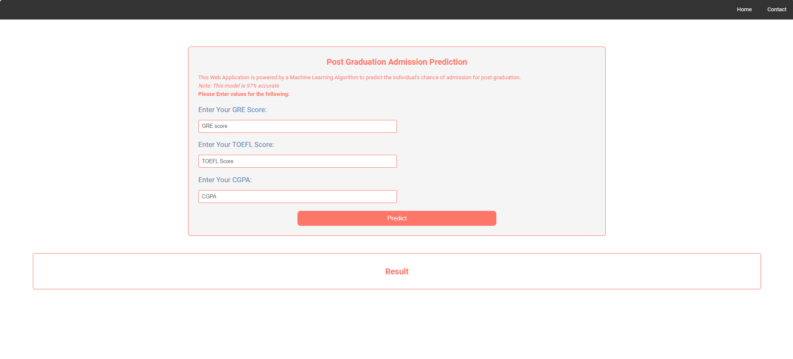
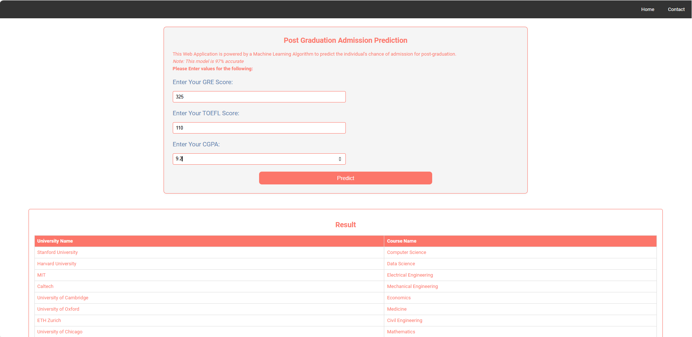

# 🎓 University Admission Prediction

This is a machine learning-based web application that predicts the likelihood of a student being admitted to a university based on their academic profile. The prediction model is built using a dataset of past admission records and deployed through a simple Flask web interface.

## 🌟 Features

- Predicts the **chances of university admission** using academic scores.
- Built using **Python**, **Flask**, and **Scikit-learn**.
- Clean and minimal **HTML interface** for easy user interaction.
- Accepts multiple inputs like GRE Score, TOEFL Score and CGPA.
- Trained and deployed ML model (`GradientBoostingClassifier`).

## 🚀 Demo

## 📊 Dataset

- **Features Used**:
  - GRE Score (out of 340)
  - TOEFL Score (out of 120)
  - CGPA (out of 10)

## 🛠 Tech Stack

- **Backend**: Python, Flask
- **Frontend**: HTML, CSS
- **ML Libraries**: Pandas, NumPy, Scikit-learn
- **Model**: Gradient Boosting Classifier
- **Environment**: Virtualenv

## Create and activate a virtual environment:

python -m venv venv

venv\Scripts\activate       # Windows

pip install -r requirements.txt

python model.py

python app.py

